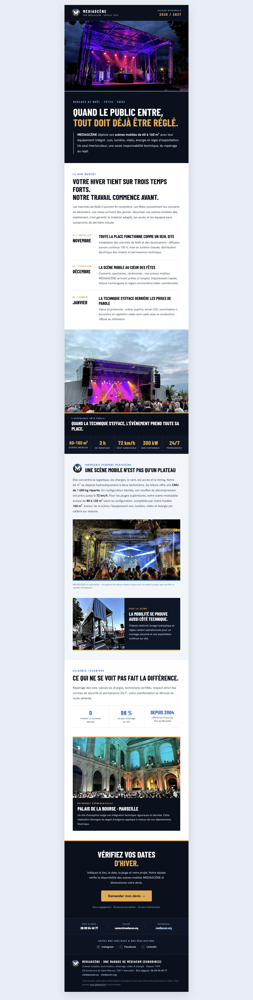


# ❄️ MEDIASCÈNE — Newsletter Hiver 2026–2027

> **Campagne Hivernale : Scènes Mobiles Couvertes & Événements Clés en Main**  
> Visualisation en direct : **[https://mazen-create11.github.io/lettre-hiver-2026-2027/](https://mazen-create11.github.io/lettre-hiver-2026-2027/)**

---

## 🎯 Objectifs & Positionnement de la Campagne

Cette newsletter met à l'honneur **MEDIASCÈNE** et sa flotte de scènes mobiles couvertes certifiées (60 m² et 80 à 120 m²) pour tous les temps forts de l'hiver :
- **Marchés de Noël & Illuminations** (places de ville, villages de montagne)
- **Cérémonies de vœux des maires & institutions**
- **Festivals et concerts d'hiver en extérieur & en station**

---

## 📱 Aperçus Rendu

| Rendu Ordinateur / Desktop | Rendu Mobile (iPhone / Android) |
| :---: | :---: |
|  |  |

---

## 💎 Caractéristiques Techniques & Améliorations

1. **Visuels 4K Ultra-HD (Moteur Dreamina AI) :**
   - Toutes les photographies ont été améliorées en 4K via Dreamina puis optimisées en Retina progressif (Lanczos 1200px, 90% qualité) pour un rendu éclatant sans flou ni compression visible.
   - Poids maîtrisé (< 350 Ko par image) assurant un affichage instantané sur mobile.
2. **Contact & Call-To-Action :**
   - **Contact direct :** Éric Algoud au **06 09 54 49 77** (bouton d'appel direct).
   - **Formulaire de devis :** Bouton CTA redirigeant vers le devis officiel Mediascène (`https://mediascene.eu/demander-un-devis/`).
   - **Lien Découvrir :** Texte visible `mediacom.org` avec redirection vers `https://mediascene.eu`.
   - **Réseaux sociaux :** Liens directs vers Instagram, Facebook et LinkedIn.
3. **Structure & Compatibilité E-mail :**
   - Tableau 100% aligné, suppression des bordures parasites sur mobile.
   - Compatibilité totale Outlook, Gmail, Apple Mail et Brevo.

---

## 📂 Fichiers Disponibles

- [`index.html`](index.html) : Version web responsive prête pour consultation directe ou hébergement GitHub Pages.
- [`lettre-hiver-brevo.html`](lettre-hiver-brevo.html) : Version avec URLs d'images absolues hébergées sur le CDN GitHub Pages pour importation directe dans Brevo.
- [`img/`](img/) : Ensemble des assets graphiques optimisés haute définition.
